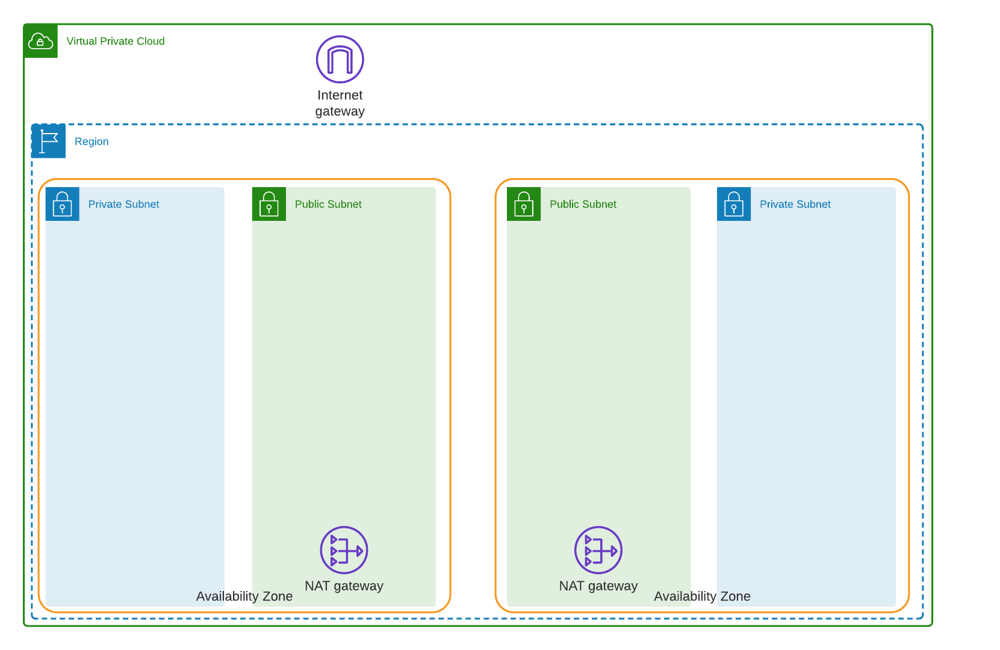
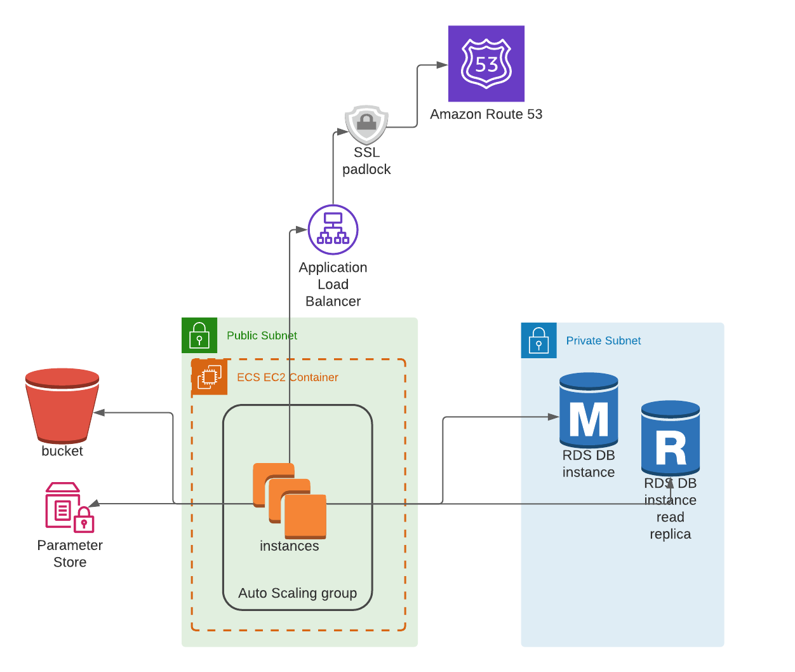

=============
Chiliseed Hub
=============

Chiliseed Hub is a service that manages pre-defined, production ready architectures for deploying containerized applications to AWS.
Each piece of infrastructure has a corresponding executor that manages it, and the Hub combines all the pieces to provide a cohesive architecture, according to best practices.

Why?
----

1. We've deployed many projects and defined same infrastructure time and again.
2. There are many ready terraform configurations out there, open sourced for everyone to use, but it still requires knowledge of what exactly is needed and how to configure it.
3. And sometimes terraform is not enough.

This project aims to provide ready-made architecture, incorporating best practices, so that we won't need to reinvent the wheel every time.

Supported Architecture
----------------------

Network architecture
^^^^^^^^^^^^^^^^^^^^




`ECS <https://aws.amazon.com/ecs/>`_ based architecture
^^^^^^^^^^^^^^^^^^^^^^^^^^^^^^^^^^^^^^^^^^^^^^^^^^^^^^^




System Requirements
-------------------

1. Latest docker engine
2. Latest docker compose


How to Run Locally
------------------


1. Download `docker-compose.public.yml` to your machine
2. Run :code:`docker-compose up -d` from a directory containing the docker compose you downloaded
3. Install chiliseed cli: :code:`brew install chiliseed/homebrew-tools/chiliseed`


Terminology
-----------

Following terms will be repeated everywhere and to make sure we all understand each other:

+-------------------+-----------------------------------------------------------+----------------------------------------+
| Name              | Description                                               | Related infra parts                    |
+===================+===========================================================+========================================+
| **Environment**   | The most basic encapsulating unit,                        | VPC, subnets, NAT gateway, Route 53    |
|                   | describes and manages global components that will relate  | hosted zone.                           |
|                   | to all your deployed apps. a.k.a staging/production/dev.  |                                        |
+-------------------+-----------------------------------------------------------+----------------------------------------+
| **Project**       | Umbrella for deployed components. Your code-base          | ALB, key pair, ECS cluster, ASG for    |
|                   | that might comprise of one or more services.              | EC2.                                   |
+-------------------+-----------------------------------------------------------+----------------------------------------+
| **Service**       | The actual unit of work, api service, background worker.  | ECS service, ECR, alb listeners/target |
|                   | Your code that needs to do some business logic.           | groups, ACM, service discovery.        |
+-------------------+-----------------------------------------------------------+----------------------------------------+
| **Resource**      | These are your databases/caches/s3 buckets.               | RDS, ElasiCache, S3                    |
+-------------------+-----------------------------------------------------------+----------------------------------------+


How to Get Started
------------------

Once you have Chiliseed hub running, you will need a set of AWS credentials and at least one user in the hub.

AWS Credentials
^^^^^^^^^^^^^^^

To get AWS credentials, you will first have to signup `here <https://portal.aws.amazon.com/billing/signup#/start>`_ for an AWS account.

Once you have an account, create a new user for Chiliseed, assign it to Admins group and select programmatic access.
This is required in order to allow the hub to modify the infrastructure on your behalf.
Remember the keys, as you will need to provide them to the system.

Each environment can have different set of aws keys. This allows the hub to maintain staging in
account A and production in account B.

Hub User
^^^^^^^^

Hub has a built-in command to create new users:

.. code-block:: bash

    docker-compose exec api python manage.py create_user <email> <password> <organization-name>

You can also assign the user admin privileges by providing: ``--is-superuser=True`` flag.

Whoever will be operating the hub, should have admin privileges.

Chiliseed CLI
^^^^^^^^^^^^^

With a set of aws and chiliseed credentials in hand, you can now start creating and deploying to the cloud.

1. To simplify your work with chiliseed, export to env your Chiliseed user credentials:

    .. code-block:: bash

        export CHILISEED_USERNAME=<email>
        export CHILISEED_PASSWORD=<password>
        export AWS_ACCESS_KEY_ID=<aws access key id>
        export AWS_SECRET_ACCESS_KEY=<aws access secret>

    **NOTE** if you don't provide specific aws credentials, chiliseed will attempt to pull them from
    default configuration locations.

2. Create an environment:

    .. code-block:: bash

        chiliseed environment create staging example.com

3. Create a project:

    .. code-block:: bash

        chiliseed project create <project name, i.e hub>

4. Create a service:

    .. code-block:: bash

        chiliseed service create

5. Create environment variables for your service:

    .. code-block:: bash

        chiliseed env_vars create <key> <value>

6. Create postgres rds:

    .. code-block:: bash

        chiliseed db create

7. Connect service to the rds:

    .. code-block:: bash

        chiliseed db list

    Copy the identifier of the db you want to connect to the service.

    .. code-block:: bash

        chiliseed service add-db <db-identifier>

8. Create s3 bucket for your service:

    .. code-block:: bash

        chiliseed service add-statics

9. Deploy your service (run this from inside the root directory of service code base):

    .. code-block:: bash

        chiliseed service deploy


Local Development
-----------------

1. Clone the repo to your local machine, ``cd`` into the directory containing the code.
2. ``cp .env.template .env``
3. Edit the values in ``.env``
4. Download and install ``ddc-shob`` tool: https://github.com/chiliseed/django-compose-shob (readme has instructions for installation)
5. To build and start the project run: ``ddc-shob start``
6. Create a user for yourself: ```ddc-shob manage-py create_user dev@chiliseed.com 'Aa123ewq!' Demoer --is-superuser=True```


License
-------

This project is licensed under the Apache License Version 2 - see _`LICENSE.md` for more details.
